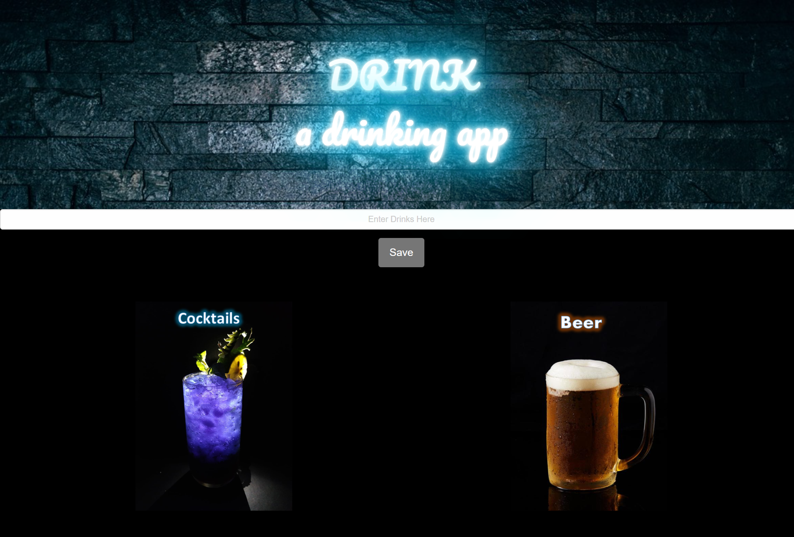
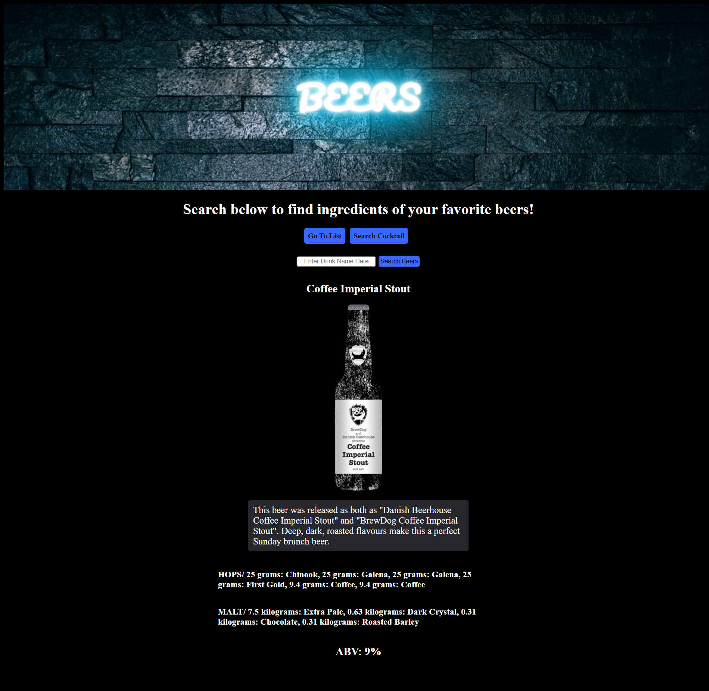

# drink

## Discription 

This project was to create an original application that pulls in two server-side APIs. In this app we used TheCocktailDB API and the Punk API. Using these two APIs and the technology we,ve leared thus far we were able to create and Drink Inquery Reasourse called DRINK©. DRINK© is a drinking app that allows users to record there favorite cocktails or beer and learn discriptions and or ingredients of there drink of choice. For example if a user is at a bar and orders a "moscow mule" and likes it. They can then type it in to there favorites list of drinks they like and use the cocktails database in the app to learn more. The cocktails database wil provide the user with the title of the drink, image of the drink, instructions or discription of the drink, and the ingredients of the drink. With this information the user can store the drinks they like to order in the future or even recreate at there own convenience. 

## Mock-up

## Deployment Links

- https://mrgreen12375.github.io/drink/

- https://github.com/mrgreen12375/drink